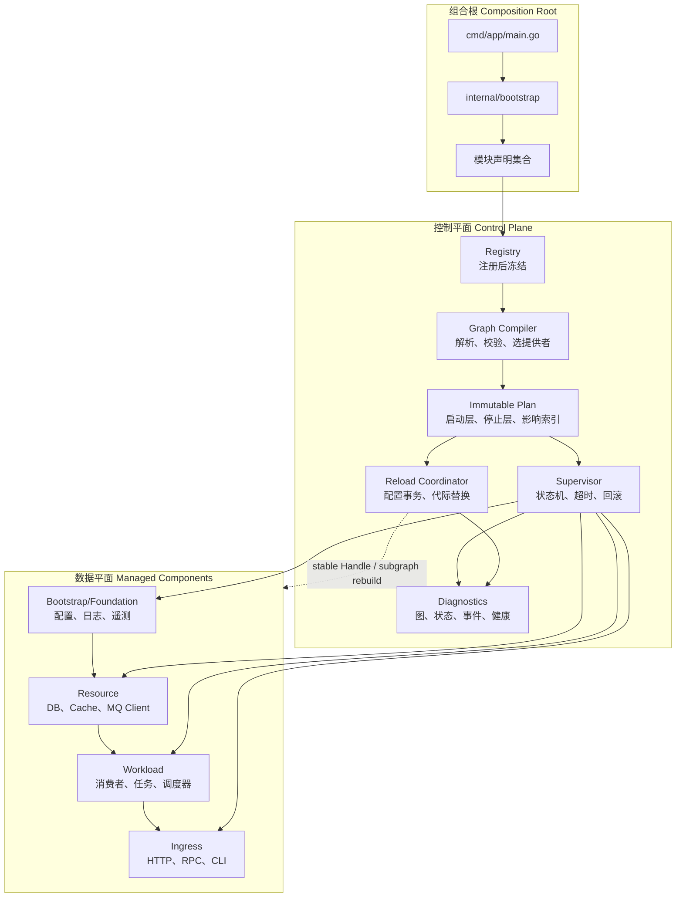
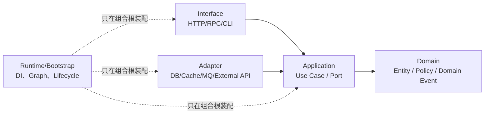
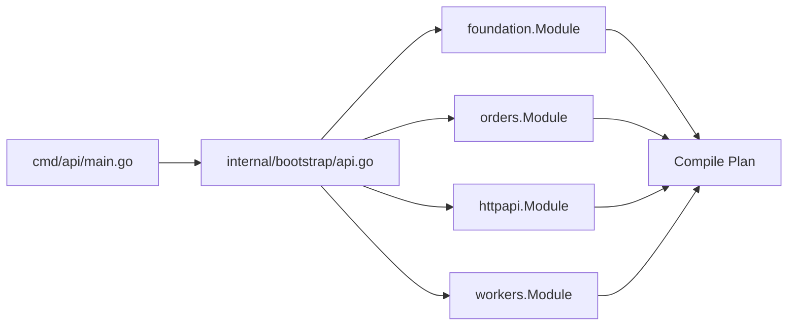
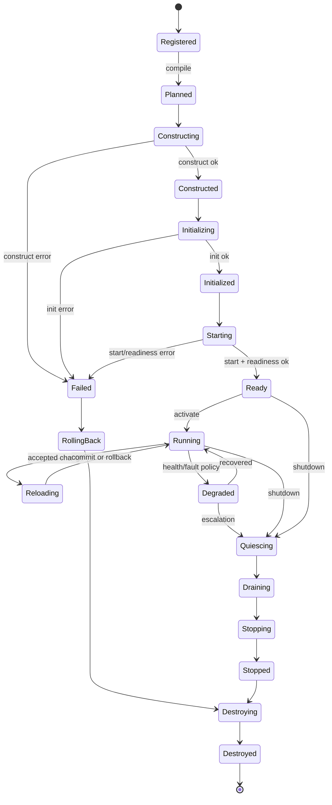
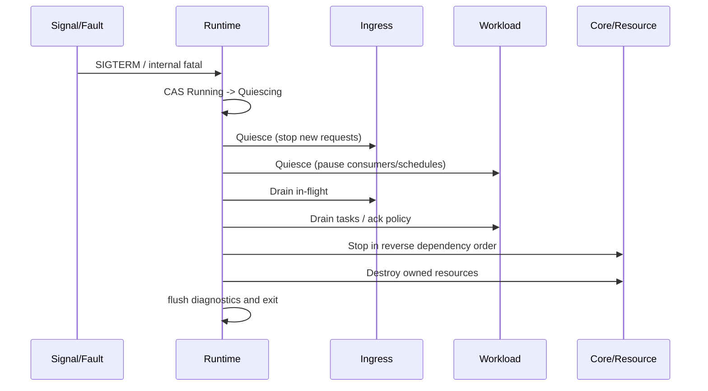
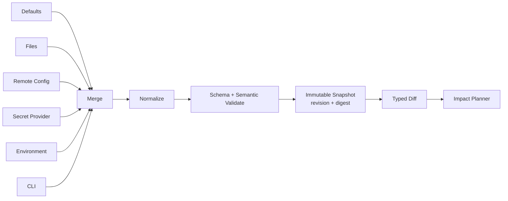
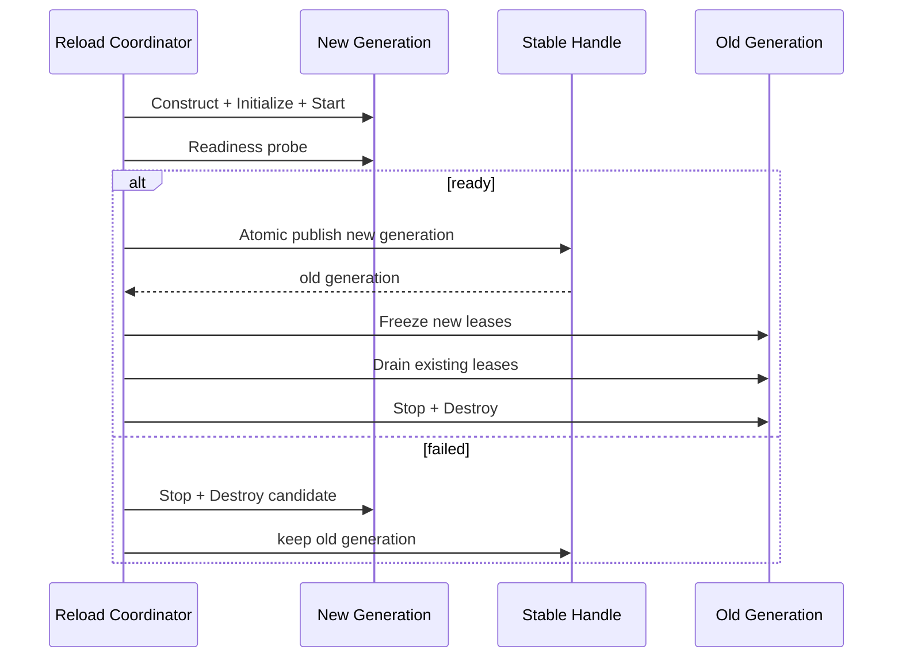
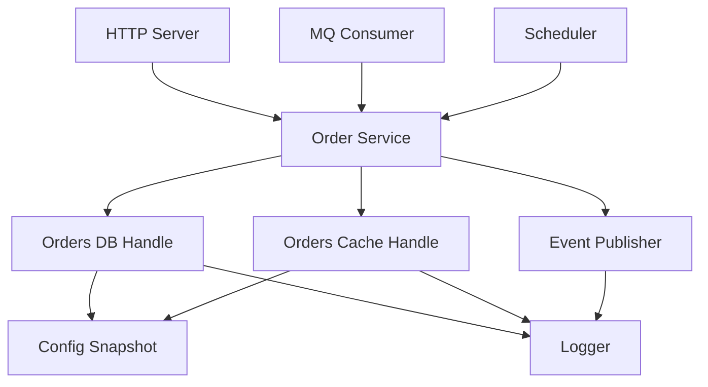

# Go 生产级依赖注入治理架构蓝图

> 文档状态：架构设计基线
> 适用模块：`micro-go`（Go 1.25.7）及同类 Go 服务
> 目标读者：架构师、Go 开发者、基础设施维护者、测试人员、AI Agent
> 性质：这是治理规范和实现图纸，不是当前仓库已有能力的说明，也不是一个仅能运行的最小 DI 容器

## 0. 一句话模型

把传统“容器创建对象”提升为一个**先编译、后执行、可事务化重载的托管组件运行时**：

1. 模块只声明组件、契约、依赖、作用域、生命周期和变更策略；
2. 组合根汇总模块，编译出不可变、确定性的依赖图与执行计划；
3. Supervisor 按计划构造、初始化、启动、激活、停止、回滚和销毁；
4. 配置与实例替换通过 revision、generation、稳定句柄和两阶段事务完成；
5. 业务代码只依赖普通 Go 接口，不知道容器、图、Supervisor 或重载协议的存在。

依赖注入是其中的**静态装配子系统**，生命周期、作用域、配置事务、故障治理和可观测性才构成完整运行时。

---

## 1. 设计目标、非目标和决策优先级

### 1.1 设计目标

- **显式**：每个依赖、资源所有者、生命周期钩子、配置影响面都可以被查询。
- **确定**：相同注册集合必须生成相同图、相同启动层和相同诊断结果。
- **封闭**：注册阶段结束后 Registry 冻结；运行期不能偷偷注册新组件。
- **强边界**：框架只存在于组合根、模块注册和运行时层，不能侵入领域与应用核心。
- **事务化**：启动、配置变更和实例替换要么提交，要么回滚到可解释状态。
- **可停止**：任何成功创建的托管资源都必须有唯一所有者和有限时清理路径。
- **局部演进**：新增模块通常只新增注册，不修改中央大文件；变更只重建最小安全子图。
- **可诊断**：图、计划、状态、配置 revision、实例 generation 和失败链都可观测。
- **可测试**：可替换契约实现，可选择性启动目标依赖闭包，不要求拉起全部基础设施。
- **保守降级**：无法证明热替换安全时，拒绝热更新或升级为进程重启，而不是冒险原地修改。

### 1.2 非目标

- 不实现运行期任意代码卸载。Go 静态链接组件和 Go `plugin` 的卸载都不适合作为通用安全边界。
- 不把 Event Bus 当成隐藏依赖或数据库事务的替代品。
- 不允许任意业务代码通过字符串从容器取服务。
- 不承诺所有配置都能热更新；热更新是组件显式声明并通过校验的能力。
- 不由 DI Runtime 自动替业务请求增加重试、事务或幂等语义；这些属于边界适配器策略。
- 不用反射“猜”构造函数参数，也不通过 `init()` 自动注册。

### 1.3 决策优先级

发生冲突时依次选择：

1. 数据正确性；
2. 可回滚和资源安全；
3. 边界清晰；
4. 可诊断性；
5. 可用性；
6. 局部热更新；
7. 启动速度和编码简短。

不能为了少写几行注册代码牺牲前五项。

---

## 2. 总体架构



控制平面与数据平面必须隔离：

- 控制平面管理**组件元数据、状态和代际**，不得承载业务调用；
- 数据平面组件通过普通 Go 接口、端口和消息契约协作；
- 管理 API 只能调用稳定的 `RuntimeControl` facade，不能访问内部 Registry、实例 map 或锁；
- 日志、指标和追踪要有 bootstrap 兜底实现，避免“为了记录 DI 启动日志，先依赖尚未启动的日志组件”的递归问题。

---

## 3. 分层边界与依赖方向



### 3.1 允许的依赖

- Domain：只依赖标准库和领域内部代码。
- Application：依赖 Domain，并定义所需端口，例如 `OrderRepository`、`EventPublisher`。
- Adapter：实现 Application 定义的端口，可依赖第三方驱动。
- Interface：把外部协议转换为 Application 命令/查询。
- Runtime/Bootstrap：知道所有具体实现，在唯一组合根完成绑定。
- 模块间：只能通过公开契约包或显式事件契约通信。

### 3.2 禁止事项

- 领域、应用服务、Handler、Repository 持有 `Container`、`Resolver` 或 `ServiceProvider`。
- 包级可变单例、`sync.Once` 隐藏初始化、在 `init()` 中注册组件。
- Adapter 反向导入 HTTP Handler，或业务模块导入 `internal/runtime`。
- 构造函数内部自行读取环境变量、打开全局配置、启动 goroutine。
- 为打破循环依赖而改用 Event Bus、回调、全局变量或运行期 `Get("name")`。
- 一个“万能 Context/Deps/App”对象包含所有服务并被到处注入。
- 业务组件自行关闭注入的 DB、Cache、Logger；借用者不是所有者。

建议用 `internal/`、契约包、`go list -deps` 检查和自定义 analyzer 共同约束，而不是只靠 Code Review 记忆。

---

## 4. 核心语义与术语

| 术语 | 含义 | 关键约束 |
|---|---|---|
| Contract | 一个可被依赖的 Go 接口或值类型 | 以类型为主键，可附 qualifier；禁止裸字符串作为唯一身份 |
| Capability | 组件对外提供的语义能力 | 可映射一个或多个 Contract；用于选择、权限和诊断 |
| Component | 由 Runtime 托管生命周期的单元 | 有稳定 `ComponentID`；不能匿名注册 |
| Definition | 组件的不可变声明 | 包含 provides/requires/scope/phase/hooks/reload/failure policy |
| Module | 一组相关 Definition 的声明器 | 无运行态、无资源、无 `init()` 副作用 |
| Registry | 组合阶段的定义收集器 | Build 后永久冻结 |
| Graph | Contract 绑定后的组件有向无环图 | 边从 consumer 指向 provider；启动反向遍历提供者优先 |
| Plan | Graph 编译产物 | 包含确定性拓扑层、关闭层、作用域规则、配置影响索引 |
| Scope | 资源实例的所有权边界 | 创建者拥有，借用者不关闭 |
| Instance | 某 Definition 的一个具体对象 | 属于某个 scope 和 generation |
| Generation | 同一 ComponentID 的一次实例代际 | 单调递增，用于替换和排空 |
| Revision | 一份不可变配置快照的版本 | 单调递增并带内容摘要 |
| Handle | 指向当前 generation 的稳定并发安全入口 | 每次借用必须 Release；禁止永久缓存借用值 |
| Lease | Handle 的一次有界借用 | 保护旧 generation 在请求结束前不被销毁 |
| Lifecycle Journal | 已完成阶段的补偿记录 | 回滚只依据 journal，不猜测组件状态 |
| Impact Set | 一次变化需要处理的组件集合 | 由配置索引、边的绑定方式和下游闭包计算 |
| Quiesce | 停止接收新工作 | 必须先于 Drain |
| Drain | 等待已接收工作完成 | 有截止时间；超时进入强制停止策略 |
| Destroy | 最终释放本 generation 自有资源 | 幂等，但错误必须被记录和聚合 |

### 4.1 ComponentID 命名

格式建议为 `<domain>.<kind>.<name>`，例如：

- `foundation.config.main`
- `foundation.telemetry.otel`
- `resource.database.orders`
- `resource.cache.redis`
- `workload.consumer.payment-events`
- `interface.http.public`

ID 一经发布不能因包移动随意变化，否则状态、指标、配置和运维记录会失去连续性。

---

## 5. 声明、注册、解析和组装

### 5.1 Definition 是唯一事实源

每个 Definition 至少声明：

- `ID`、`Module`、`Description`、`Version`；
- `Provides`：Contract、qualifier、是否主提供者；
- `Requires`：Contract、版本/标签选择器、必需/可选、多值、绑定方式；
- `Scope`、`Phase`；
- 构造工厂；
- 生命周期能力和各阶段超时；
- 配置路径、敏感字段、重载策略；
- 健康、失败、重启、回滚策略；
- 资源所有权说明。

Definition 不得包含已经创建的连接、goroutine 或运行态锁。

### 5.2 注册规则

1. 只有组合根调用模块的 `Register`。
2. 注册顺序不能影响 provider 选择和拓扑结果；所有排序以稳定 ID 为准。
3. 同一 `ComponentID` 重复注册立即报错。
4. 同一 Contract 存在多个 provider 时，必须通过 qualifier、selector 或显式 collection 消除歧义。
5. 测试替换必须通过 `Override` API，并记录原 provider、替代 provider 和原因；生产构建默认禁止 Override。
6. Registry 一旦 `Compile()` 成功或失败都不再接受注册，避免修修补补地反复 Build。
7. 模块声明必须无副作用，可重复调用并得到等价定义。

### 5.3 解析发生在“编译计划”而不是业务运行期

Graph Compiler 执行：

1. Definition schema 校验；
2. Contract provider 索引；
3. selector 和版本约束求解；
4. requirement 到 provider 的唯一绑定；
5. 缺失、歧义、冲突检查；
6. 架构层和作用域合法性检查；
7. 生命周期、启动 phase 和重载安全检查；
8. Tarjan/Kahn 循环检测与稳定拓扑分层；
9. 构建反向边、下游闭包和配置影响索引；
10. 输出 immutable Plan、JSON/DOT/Mermaid 诊断模型。

运行期不再进行“找一个差不多的实现”。启动前不能完成的选择就应视为设计缺陷。

### 5.4 唯一允许的受限 Resolver

构造工厂可能需要一个受限 Resolver，但必须同时满足：

- 只在 `Construct` 调用栈内有效，调用后立即失效；
- 只能读取 Definition 已声明的 requirements；
- 只能通过类型安全 `Ref[T]` 获取；
- 获取结果被转成普通构造参数，Resolver 不能保存进组件；
- 每次解析记录 consumer/provider/binding/generation；
- 未声明、跨 scope 或已过期访问立即失败。

更严格的项目应由代码生成器把 `Inputs` 参数结构绑定成构造函数，完全消除业务可见 Resolver。

### 5.5 依赖边的绑定方式

| Binding | 使用场景 | 替换影响 |
|---|---|---|
| `Static` | 普通接口、不可替换对象 | provider 变化时必须重建 consumer 下游闭包 |
| `Handle` | DB client、远端 client、策略等可代际切换对象 | consumer 保持稳定 Handle，通常只替换 provider |
| `Collection` | 多个 Handler、Exporter、Validator | 集合成员变化需生成新不可变快照；按声明策略替换或重建 |
| `Factory` | 请求级、任务级、临时实例 | 注入受控工厂，实例由子 scope 拥有 |
| `Optional` | 真正可缺省的附加能力 | consumer 必须声明缺省行为；不得掩盖核心依赖缺失 |

不要把 `Handle` 用作逃避依赖图的通用指针。只有接口调用能在一次 Lease 内完成、旧实例可排空、切换语义可证明时才允许使用。

---

## 6. 组合根与模块化装配

`cmd/<app>/main.go` 只做四件事：解析进程参数、建立根 context、选择显式模块集合、调用 `bootstrap.Run`。



模块规则：

- `Module` 只返回元数据并注册 Definition，不创建对象；
- 模块公开 `Name`、`Version`、`Imports`、`Exports`；
- Imports/Exports 是架构边界，不等同于 Go package import；
- 模块只能导出稳定 Contract，不能导出内部具体类型；
- 模块注册文件按能力拆分，例如 `database.go`、`cache.go`、`http.go`，不要出现无限增长的 `wire.go`；
- 可选能力由组合根明确选择，不通过运行期探测“有就用”；
- feature flag 改变业务行为，不负责偷偷改变组件结构；图结构变化走受控重建。

组合根本身应很无聊：它是架构清单，不是初始化脚本。

---

## 7. 作用域与资源所有权

### 7.1 标准作用域

| Scope | 生存期 | 典型对象 | 所有者 |
|---|---|---|---|
| `Singleton` | 进程内所有 Application 共享 | bootstrap logger、进程指标 exporter | Process Scope |
| `Application` | 一次应用运行 | DB pool、Redis client、Event Bus、HTTP server | Application Scope |
| `Request` | 一次 HTTP/RPC 请求 | request transaction、request cache | Request Scope |
| `Task` | 一次消息/定时/后台任务 | unit of work、task transaction | Task Scope |
| `Transient` | 一次显式创建/借用 | parser、短期 buffer、临时 client | 创建它的最近父 Scope |

`Request` 与 `Task` 是兄弟作用域，互相不可依赖。共享逻辑应上移到 Application 契约或由各自工厂创建。

### 7.2 作用域依赖法则

长生命周期组件只能直接依赖同寿命或更长寿命组件：

```text
Singleton -> Singleton
Application -> Singleton | Application
Request -> Singleton | Application | Request
Task -> Singleton | Application | Task
Transient -> 由所属 owner scope 决定
```

`Application -> Request` 即 captive dependency，编译期必须拒绝。正确做法是注入 `ScopeFactory[Request]` 或请求内工厂，而不是保存某个请求实例。

### 7.3 所有权法则

- Scope 创建并登记实例，因此 Scope 是唯一最终关闭者。
- 注入依赖是借用；consumer 不得调用其 `Close`。
- 组件构造期间自行创建的私有资源，由该组件在 `Destroy` 中释放。
- Runtime 创建的包装器、Handle、子 Scope 和 generation，由 Runtime 释放。
- 每个 `Acquire` 都要 `Release`，推荐用 `defer release()`；不得把借用值放入全局变量、长期 goroutine 或跨请求缓存。
- `Close`/`Destroy` 必须幂等，但幂等不是吞掉错误；首次错误和后续重复调用都应有状态记录。

---

## 8. 生命周期协议与状态机

### 8.1 状态机



状态转换只能由 Supervisor 串行提交；组件不能直接篡改 Runtime 状态。

### 8.2 生命周期阶段

| 阶段 | 允许做什么 | 禁止做什么 |
|---|---|---|
| Register | 声明元数据 | I/O、goroutine、连接 |
| Construct | 纯装配、分配本地对象 | 对外服务、无限等待 |
| Initialize | 校验配置、准备资源、迁移前检查 | 接受业务流量 |
| Start | 建立连接、准备队列、绑定 listener | 启动无人监管的长期 goroutine、开放流量 |
| Run | 在 Supervisor 托管下执行长期阻塞循环 | 脱离组件 context、返回后私自重启 |
| Readiness | 有界探测关键依赖 | 无超时阻塞 |
| Activate | 开启 ingress/consumer/scheduler | 修改图 |
| Run | 处理业务 | 保存 Resolver、越权关闭依赖 |
| Quiesce | 停止接收新工作 | 立即杀死在途工作 |
| Drain | 等待在途工作完成 | 接收新工作 |
| Stop | 取消循环、关闭协议服务 | 关闭借用资源 |
| Destroy | 释放自有资源 | 再创建新资源 |

组件可以只实现需要的可选钩子，但 Definition 必须准确声明。Supervisor 负责统一调用，不允许组件 A 手工调用组件 B 的 Start/Stop。

### 8.3 并发与幂等约束

- 每个 generation 的状态转换由单写锁或 actor loop 串行化；
- `Start` 成功后再次调用返回 `ErrAlreadyStarted`，而不是重复创建 goroutine；
- 长期循环实现阻塞式 `Run(ctx) error`，由 Supervisor 建立、取消和等待；非预期返回按 FaultPolicy 处理；
- 必须创建子 goroutine 的组件使用 Runtime 注入的 component-scoped task group，所有任务继承组件 context 并在 Stop 前 Join；
- `Stop`、`Destroy` 可重复调用，第二次返回已完成状态；
- 同一 ComponentID 同时只允许一个 reload transaction；
- shutdown 一旦进入 `Quiescing`，新的 reload 必须被拒绝或取消；
- lifecycle hook 必须接收 context，遵守 deadline，并在返回前停止自己创建但尚未托管的临时 goroutine；
- Runtime 在 hook 返回后才能提交状态，组件自己报告 Ready 只是一项证据，不是状态提交权。

---

## 9. 启动、就绪、运行和优雅关停

### 9.1 启动 phase

除依赖拓扑外再设置粗粒度 phase barrier：

1. `Bootstrap`：配置快照、bootstrap logging、诊断基础；
2. `Foundation`：正式日志、指标、追踪、内部事件；
3. `Resource`：DB、Cache、MQ、外部 client；
4. `Application`：用例服务、策略、Handler；
5. `Workload`：MQ consumer、scheduler、后台任务；
6. `Ingress`：HTTP/RPC listener；
7. `Activate`：统一开放流量。

Graph 必须拒绝 provider phase 晚于 consumer phase 的 phase inversion。一个 phase 内按拓扑层并发，层间串行；并发度由 Supervisor 限制。

### 9.2 启动算法

```text
Compile and freeze plan
Create application scope and lifecycle journal
For each phase:
  For each provider-first topological layer:
    Construct in bounded parallelism
    Initialize in bounded parallelism
    Start in bounded parallelism
    Launch declared Runner under Supervisor ownership
    Probe readiness with deadline
    Append each successful action to journal
Activate workloads and ingress only after all mandatory nodes are ready
Publish application Ready and start health supervision
```

关键约束：

- `Start` 超时视为失败，即使 goroutine 随后自己成功也不能提交；组件必须响应取消并清理。
- 可选组件失败只有在 Definition 明确允许 degraded start 时才不阻塞全局 Ready。
- Readiness 必须区分“依赖暂时不可用”和“配置/认证永久错误”，后者不应盲目重试。
- 对 DB migration 等具有外部不可逆副作用的步骤，必须单独建模为 migration job，并提供幂等/补偿策略；不能假装销毁连接就回滚了数据库变更。

### 9.3 优雅关停



规则：

- 第一次信号触发有界优雅关闭；第二次信号触发强制取消，但仍尝试短时 flush；
- 使用独立 shutdown context，不复用已经取消的 root context；
- 先关闭 admission，再 Drain，再 consumer-first Stop，最后 Destroy provider；
- 每层可并行停止互不依赖节点，但必须保持反向拓扑 barrier；
- 超时后记录未停止组件、goroutine/lease 数、持有时长，再进入组件声明的强制策略；
- 最终退出码保留首要故障，清理错误通过 `errors.Join` 附加，不能覆盖根因。

---

## 10. 启动失败与回滚

Lifecycle Journal 为每次成功动作记录：

```text
component_id, generation, action, completed_at, compensation, timeout
```

失败后：

1. 冻结新动作；
2. 取消同层尚未完成的 hook；
3. 等待有界收敛；
4. 按 journal 逆序执行补偿；
5. 已 Activate 的先 Quiesce/Drain；
6. 已 Start 的执行 Stop；
7. 已 Initialize/Construct 的执行 Destroy；
8. 聚合 rollback error 并输出最终状态快照。

异常边界：

- 构造函数返回对象和错误时，约定对象不被接管；工厂必须自行清理半成品。推荐返回 `(nil, err)`。
- 如果 Runtime 已登记实例后下一阶段失败，Runtime 负责 Destroy。
- 外部不可逆操作必须在 Definition 标成 `NonCompensable`。存在此类动作时，全局回滚只能做到资源清理，状态报告必须明确“外部副作用未回滚”。
- panic 必须在 hook 边界捕获、转换为带 stack 的 error，再按失败流程处理；不允许 panic 穿透导致跳过清理。
- rollback 自身有独立总截止时间；单个补偿失败不能阻止其余补偿继续执行。

---

## 11. 配置治理

### 11.1 配置流水线



推荐优先级：defaults < files < remote config < environment < CLI。Secret 引用先解析为受保护值，再进入类型化配置；禁止把 secret 明文放进图、日志、错误或诊断 JSON。

### 11.2 配置模型

- 配置按模块拥有，例如 `database.orders.*`，禁止共享无主的巨大 `AppConfig`；
- 组件只接收自己的不可变类型化配置视图；
- Snapshot 带 `Revision`、内容摘要、来源摘要、创建时间和 schema version；
- 默认值在 schema 层一次性展开，业务代码不能到处 `if zero then default`；
- 校验分为 schema、跨字段语义、外部 preflight；外部 preflight 必须有超时且不修改外部状态；
- Secret 类型实现安全 `String`/marshal 行为，默认输出 `<redacted>`；
- 配置版本升级使用显式 migration，不能同时兼容无限多个旧字段。

### 11.3 ReloadPolicy

| Policy | 语义 | 例子 |
|---|---|---|
| `DynamicApply` | 对当前实例调用事务式 Apply | 日志级别、限流阈值 |
| `ReplaceSelf` | 构造新 generation，经 Handle 切换 | DB/Redis client、策略 |
| `RestartDownstream` | provider 与 Static 下游闭包一起重建 | 静态注入的 client |
| `ProcessRestart` | 记录新 revision，拒绝进程内应用 | listener 协议、不可安全迁移参数 |
| `Immutable` | 运行期拒绝变化 | 组件 ID、数据加密根参数 |

默认值是 `ProcessRestart` 或 `Immutable`，不是 `DynamicApply`。

### 11.4 配置变更事务

1. watcher 对事件去抖、合并，产生候选 Snapshot；
2. 验证 revision 单调性和 schema；
3. 生成 typed diff，映射到声明了配置路径的组件；
4. 计算最小安全 Impact Set；
5. 检查所有组件策略、作用域、资源预算和 shutdown 竞争；
6. `Validate`：每个参与者纯校验；
7. `Prepare`：预建新实例/新状态，但不对外可见；
8. `Probe`：新 generation readiness；
9. `Commit`：按事务屏障切换 snapshot 和 Handle；
10. `Drain`：排空旧 generation；
11. `Destroy`：释放旧实例；
12. 发布 `ConfigCommitted` 和状态快照。

任一步在 Commit 前失败：销毁候选，旧 revision 继续运行。Commit 后进入观察窗口；若声明支持 rollback 且旧 generation 尚保留，可执行受控切回，否则进入 degraded/fatal 策略。

---

## 12. 局部重建、依赖子图重启与代际替换

### 12.1 Impact Set 计算

假设图边为 `consumer -> provider`：

1. 由配置路径找到直接受影响节点 `Seeds`；
2. `DynamicApply` 节点不扩散；
3. `Handle` 边默认不把 consumer 加入集合；
4. `Static`、改变集合形状或构造参数的边，把 consumer 及其下游 consumer 闭包加入集合；
5. 加入同一原子重启组 `RestartGroup`；
6. 若遇到不支持局部重建的边界，升级为 Application 或 Process restart；
7. 对 Impact Set 重新做 scope、phase、资源预算和循环校验。

### 12.2 安全替换协议



### 12.3 Handle/Lease 规则

- Handle 内部原子指向 generation record；
- `Acquire` 在读到 generation 后增加 lease count，并再次确认未 freeze；
- `Release` 只减少对应 generation，不依赖当前指针；
- Swap 后旧 generation 禁止新 lease，但已有 lease 可在 deadline 内完成；
- Drain 完成后才能 Stop/Destroy；
- 请求必须在一次业务操作内 Acquire/Release，不能跨无界 goroutine；
- 需要事务一致性的多次调用必须固定在同一 Lease，不得每次调用重新 Acquire 导致跨 generation；
- collection 更新使用不可变快照，不在原 slice 上修改；
- 组件若无法满足这些条件，只能使用 Static + 下游重建。

### 12.4 切换原子性边界

单个 Handle 的 CAS 是原子的，多组件切换不是天然原子。跨组件一致性有三种策略：

1. **单聚合 Handle**：把必须同时切换的组件封装成一个 generation bundle；
2. **Revision Gate**：请求进入时固定 revision，所有 Handle 按 revision 取同一批 generation；
3. **短暂停入**：Quiesce 相关 ingress，切换全部组件后再 Activate。

不能把多个独立 `atomic.Pointer` 的连续 Store 宣称为“事务”。

---

## 13. 组件通信治理

### 13.1 通信方式选择

| 需求 | 机制 | 约束 |
|---|---|---|
| 当前调用必须立即得到结果 | 同步 Go 接口 | 明确 context、error、timeout；调用方向符合分层 |
| 一个意图只有一个处理者 | Command Bus 或直接 Application Service | 命令类型稳定、单 handler、可跟踪 |
| 同进程多个订阅者感知事实 | Internal Event Bus | 有界队列、背压、订阅所有权、失败策略 |
| 跨服务可靠通知 | Broker + Outbox/Inbox | 定义交付语义、幂等键、schema version |
| 领域内表达已发生事实 | Domain Event | 领域类型，不依赖基础设施事件类型 |
| Runtime 状态变化 | Control Event Stream | 与业务事件总线分离，不能触发隐式业务依赖 |
| 高频状态读取 | 明确 Query/State Snapshot | 不用广播事件模拟共享内存 |

### 13.2 事件约束

- 事件必须有 `EventID`、`Type`、`SchemaVersion`、`OccurredAt`、correlation/causation ID；
- 发布者只承诺契约，不知道订阅者；
- 订阅注册显式出现在模块 Definition；
- 内存总线必须定义队列容量、溢出策略、同步/异步、顺序、重试和 dead-letter；
- 领域事务与消息发布要求一致性时使用 outbox，不依赖“先写库再 publish 大概率成功”；
- Runtime 生命周期事件不得被组件用来绕过 requires 声明；
- Event Bus 不允许解决同步强一致依赖，也不允许用于隐藏循环依赖。

---

## 14. 运行时故障、隔离与弹性

### 14.1 健康维度

- `Startup`：是否完成一次性启动；
- `Readiness`：是否能接收新流量；
- `Liveness`：进程/组件控制循环是否存活；
- `Dependency`：外部依赖状态；
- `Degraded`：仍可服务但能力受限。

Liveness 不应因为远程 DB 暂时不可用而失败并触发容器重启风暴；Readiness/Degraded 更适合表达依赖故障。

### 14.2 FaultPolicy

每个组件显式选择：

- `IgnoreWithSignal`：非关键附加能力，记录并降级；
- `Isolate`：停止该组件，不扩散；
- `RestartSelf`：带预算重启本 generation；
- `RestartSubgraph`：重启依赖它的静态下游闭包；
- `FailApplication`：触发全局优雅关闭；
- `FailProcessFast`：仅用于状态已不可证明安全的情况。

默认不得无限重启。重启预算至少包含时间窗、最大次数、指数退避、full jitter 和熔断冷却。

### 14.3 弹性策略归属

- timeout：每个网络/队列边界必须有；
- retry：只在调用边界，且操作可幂等、错误可重试、预算允许时使用；
- circuit breaker：由具体远端 adapter 拥有；
- rate limit：在 admission/adapter 层；
- bulkhead：为不同依赖或 workload 分配独立并发/连接/队列预算；
- fallback：由 Application 明确业务语义，Runtime 不猜；
- cancellation：从 request/task root 向下传播，禁止用 `context.Background()` 脱离所有权；
- 后台任务若必须跨请求继续，必须交给 Application-owned task runner 重新建立 Task Scope。

不重试：配置校验、权限/认证失败、依赖图错误、非幂等写且无幂等键、资源预算耗尽。

---

## 15. 依赖图校验、静态检查与诊断

### 15.1 Compile 必须拒绝

- 循环依赖；
- 必需 Contract 未注册；
- provider 歧义或非法重复；
- selector/version 无匹配；
- captive dependency 和 Request/Task 跨 scope；
- phase inversion；
- 非法架构层依赖；
- Static 下游却声称 provider 可单独 ReplaceSelf；
- 声明热更新但没有并发安全协议；
- 托管资源没有 Destroy/ownership 声明；
- ingress 在依赖 Ready 前 Activate；
- 同一资源被多个 Definition 声明拥有；
- RestartGroup 自身形成不一致边界。

### 15.2 Compile 应警告

- 无任何入口或下游的孤立组件；
- Optional dependency 没有显式 fallback；
- 过高 fan-in/fan-out；
- 一个模块导出过多 Contract；
- lifecycle timeout 缺失或大于全局预算；
- 使用 Transient 但对象实现 `io.Closer`；
- Config path 无 owner 或多个 owner；
- 组件标记 critical 但 FaultPolicy 为 Ignore；
- Handle 平均 Lease 可能跨越 drain deadline。

### 15.3 静态 analyzer

建议实现 `go vet` analyzer：

- 禁止非 bootstrap 包导入 runtime/container；
- 禁止组件结构体字段出现 `Container`/`Resolver`；
- 禁止 package-level 可变服务对象；
- 禁止 `init()` 注册；
- 检查 lifecycle 方法是否丢弃 context；
- 检查 `Acquire` 结果在显然路径上未 Release；
- 检查构造函数启动 goroutine；
- 检查跨层 package import；
- 检查 secret 类型被格式化为 `%v/%s`。

静态检查无法证明并发语义，Handle 使用仍需 race test、故障注入和 Drain 测试。

### 15.4 诊断输出

CLI/API 至少提供：

```text
di validate              # 只编译和校验
di graph --format json   # 完整机器可读图
di graph --format dot    # 可视化
di plan start            # phase + provider-first layers
di plan stop             # consumer-first layers
di explain <component>   # provider、consumer、scope、config、policy
di impact <config-path>  # 预演热更新影响集
di status                # state、generation、revision、health
di events --since <seq>  # 控制平面事件
```

图快照应包含 schema version，便于 CI 比较。对图的新增边、scope 变化、critical policy 变化可设置架构审批门禁。

---

## 16. 可观测性

### 16.1 统一事件模型

每个 lifecycle event 包含：

```text
event_seq, timestamp, application_id,
component_id, module, generation, config_revision,
phase, from_state, to_state, action,
duration_ms, result, error_code,
trace_id, cause_event_seq
```

禁止把 secret、完整 DSN、token 或高基数请求数据放入属性。

### 16.2 日志

- 结构化日志，以 `component_id/generation/revision/action` 为固定字段；
- 只在状态边界记录 INFO，轮询细节用 DEBUG，失败只在责任边界记录一次主日志；
- Bootstrap logger 永远可用；正式 logger 就绪后可切换 sink，但不能丢失早期 journal；
- 回滚输出原始失败和全部补偿错误。

### 16.3 指标

建议：

```text
di_lifecycle_duration_seconds{component,action,result}
di_component_state{component,state}
di_component_generation{component}
di_config_revision
di_reload_total{component,result,policy}
di_reload_impact_size
di_rollback_total{reason,result}
di_active_leases{component,generation}
di_drain_duration_seconds{component,result}
di_health_status{component,kind}
```

ComponentID 集合来自静态注册，基数有界；error 文本不得作为 label。

### 16.4 Tracing

- `app.start`、每个 phase、每个 hook、reload transaction、rollback 建立 span；
- 组件 hook span 链接到触发它的 config/fault event；
- 业务 trace 与 lifecycle trace 分离，但通过 generation/revision 可关联；
- tracing exporter 自身失败不能导致应用启动循环，可降级到本地诊断。

### 16.5 健康与诊断端点

- `/startupz`：启动是否完成；
- `/readyz`：mandatory ingress/workload 依赖是否 Ready；
- `/livez`：Supervisor 主循环是否活跃；
- `/healthz/details`：受保护的组件级状态；
- `/debug/di/graph`、`/debug/di/events`：仅管理面、鉴权、脱敏、限流。

公开 health 端点不能暴露拓扑、地址、用户名、版本漏洞信息或 secret 来源。

---

## 17. 基础能力接入规范

### 17.1 配置中心

- 属于 Bootstrap/Foundation；
- 输出不可变 Snapshot 和变更流，不暴露内部 mutable map；
- watcher 只产生候选 revision，不直接调用组件；
- 远程配置失联按 last-known-good 策略，不删除当前配置。

### 17.2 日志与遥测

- 提供进程级 bootstrap 实现和 Application 级正式实现；
- Logger 注入普通接口或值对象，不把全局 logger 作为服务定位器；
- flush 在停止末段执行，但诊断 journal 必须在 exporter 停止前落盘/输出。

### 17.3 数据库

- Application scope 拥有 pool，Repository 借用；
- 启动时只做有界 ping/preflight；migration 是独立组件或部署 job；
- DSN 变化优先 ReplaceSelf + Handle；
- 事务必须 Request/Task scoped，不能注入到 Application singleton；
- Drain 等待事务 Lease，超时执行明确的取消/回滚策略。

### 17.4 Cache

- client 为 Application scope；
- cache miss/failure 的业务降级在 Application 定义；
- key namespace/schema version 显式；
- client 替换可 Handle，缓存语义变化通常需要 RestartDownstream 或 ProcessRestart。

### 17.5 消息队列

- producer client 是 Resource；
- consumer 是 Workload，必须最后 Activate、最先 Quiesce；
- Drain 明确 ack/nack/requeue 和未完成消息策略；
- handler 每条消息建立 Task Scope；
- retry、DLQ、幂等和 offset ownership 不由 Event Bus 隐式处理。

### 17.6 HTTP/RPC

- listener/server 为 Ingress；
- Start 可绑定但不得在全局 Activate 前通过 readiness gate 接收业务流量；
- 每请求建立 Request Scope；
- Quiesce 先移出服务发现/关闭 admission，再执行协议 GracefulStop；
- Handler 只依赖 Application port。

### 17.7 Scheduler/后台任务

- scheduler 为 Workload，每次执行建立 Task Scope；
- 禁止构造时启动 ticker；
- Quiesce 停止新调度，Drain 等待当前任务；
- 分布式任务必须声明 leader/lease/幂等语义。

### 17.8 CLI

- 一次性 command 可以选择目标组件的 provider 闭包启动；
- command handler 建立 Task Scope；
- `di validate/graph/impact` 只编译计划，不连接外部基础设施；
- 需要 DB 的 migration command 显式选择 DB + migration 子图。

### 17.9 插件

- 默认采用静态链接模块清单；
- 远程/进程外插件通过 RPC 契约、进程监督和版本握手隔离；
- 不依赖 Go `plugin` 实现热卸载；
- 插件只能依赖公开 SDK/Contract，不得导入宿主 `internal`；
- 权限、资源预算、配置前缀和导出 Contract 必须在 Manifest 中声明。

---

## 18. 推荐工程目录

```text
micro-go/
├── cmd/
│   ├── api/main.go                    # 进程入口，不写装配细节
│   └── tool/main.go                   # validate/graph/migrate 等 CLI
├── internal/
│   ├── bootstrap/
│   │   ├── api.go                     # 唯一组合根
│   │   ├── modules.go                 # 显式模块清单
│   │   └── policies.go                # 全局预算和生产策略
│   ├── runtime/
│   │   ├── registry/                  # 注册、冻结、Override 审计
│   │   ├── graph/                     # 解析、校验、拓扑、impact
│   │   ├── lifecycle/                 # 状态机、journal、rollback
│   │   ├── scope/                     # Process/App/Request/Task
│   │   ├── reload/                    # revision/generation/Handle
│   │   ├── supervisor/                # 启停、故障、信号
│   │   ├── health/                    # 健康聚合
│   │   ├── diagnostics/               # graph/status/events
│   │   └── control/                   # 稳定管理 facade
│   ├── platform/
│   │   ├── config/
│   │   ├── logging/
│   │   ├── telemetry/
│   │   ├── database/
│   │   ├── cache/
│   │   ├── messaging/
│   │   ├── httpserver/
│   │   └── scheduler/
│   ├── modules/
│   │   ├── foundation/module.go
│   │   ├── orders/
│   │   │   ├── application/
│   │   │   ├── domain/
│   │   │   ├── adapters/
│   │   │   └── module.go
│   │   └── publicapi/module.go
│   └── generated/
│       └── wiring/                     # 可选的类型安全装配代码
├── pkg/
│   └── contracts/                      # 真正需要跨模块公开的稳定契约
├── sdk/
│   ├── component/                      # Definition/Manifest 公共模型
│   ├── contract/                       # Ref/Handle/Lease
│   └── module/                         # Module 注册 API
├── configs/
│   ├── schema/
│   └── example/
├── docs/
│   ├── architecture/
│   ├── adr/
│   └── runbooks/
├── tools/
│   ├── dianalyzer/                     # go vet analyzer
│   └── digraph/                        # JSON/DOT/Mermaid 导出
└── tests/
    ├── graph/
    ├── lifecycle/
    ├── reload/
    ├── fault/
    └── integration/
```

目录约束：

- `sdk` 只放稳定、窄小、可供模块实现者依赖的契约；
- `internal/runtime` 不依赖具体业务模块；
- `internal/bootstrap` 可以依赖所有具体模块，它是唯一“知道全世界”的地方；
- 每个业务模块自带 `module.go`，中央文件只列模块，不列每个对象；
- 架构决策进入 ADR，故障处理进入 runbook，不把关键语义只留在注释或口头约定。

---

## 19. 核心 Go 抽象

以下代码用于锁定 API 语义；后续实现可以拆包，但不得改变边界含义。

### 19.1 Definition、依赖与策略

```go
package component

import (
	"context"
	"reflect"
	"time"
)

type ID string
type ModuleID string
type Qualifier string

type Scope uint8

const (
	ScopeSingleton Scope = iota + 1
	ScopeApplication
	ScopeRequest
	ScopeTask
	ScopeTransient
)

type Phase uint8

const (
	PhaseBootstrap Phase = iota + 1
	PhaseFoundation
	PhaseResource
	PhaseApplication
	PhaseWorkload
	PhaseIngress
)

type Binding uint8

const (
	BindingStatic Binding = iota + 1
	BindingHandle
	BindingCollection
	BindingFactory
)

type Contract struct {
	Type      reflect.Type
	Qualifier Qualifier
}

func ContractOf[T any](q Qualifier) Contract {
	return Contract{Type: reflect.TypeFor[T](), Qualifier: q}
}

type Requirement struct {
	Contract Contract
	Binding  Binding
	Optional bool
	Many     bool
}

type ReloadPolicy uint8

const (
	ReloadImmutable ReloadPolicy = iota + 1
	ReloadDynamicApply
	ReloadReplaceSelf
	ReloadRestartDownstream
	ReloadProcessRestart
)

type Timeouts struct {
	Construct time.Duration
	Initialize time.Duration
	Start time.Duration
	Ready time.Duration
	Quiesce time.Duration
	Drain time.Duration
	Stop time.Duration
	Destroy time.Duration
}

// Resolver 只能传入 Factory，且只能解析 Definition.Requires 中的契约。
// Factory 返回后 Resolver 失效，Instance 内不得保存它。
type Resolver interface {
	Resolve(ctx context.Context, contract Contract, target any) error
}

type Factory func(context.Context, Resolver) (any, error)

type Definition struct {
	ID           ID
	Module       ModuleID
	Description  string
	Scope        Scope
	Phase        Phase
	Provides     []Contract
	Requires     []Requirement
	ConfigPaths  []string
	Reload       ReloadPolicy
	Timeouts     Timeouts
	Critical     bool
	Factory      Factory
}
```

生产实现还应增加 version selector、failure policy、restart budget、restart group、health policy、ownership 和 architecture layer；此处省略的是代码篇幅，不是治理要求。

### 19.2 生命周期能力接口

```go
package lifecycle

import "context"

type Initializer interface {
	Initialize(context.Context) error
}

type Starter interface {
	Start(context.Context) error
}

// Runner 是由 Supervisor 启动和监督的长期阻塞循环。
// 正常运行时不应返回；context 取消后的正常返回不视为运行故障。
type Runner interface {
	Run(context.Context) error
}

type Readiness interface {
	Ready(context.Context) error
}

type Activator interface {
	Activate(context.Context) error
}

type Quiescer interface {
	Quiesce(context.Context) error
}

type Drainer interface {
	Drain(context.Context) error
}

type Stopper interface {
	Stop(context.Context) error
}

type Destroyer interface {
	Destroy(context.Context) error
}

type DynamicConfig[T any] interface {
	ValidateConfig(context.Context, T) error
	PrepareConfig(context.Context, T) error
	CommitConfig(context.Context, T) error
	RollbackConfig(context.Context, T) error
}
```

不要定义要求所有组件实现全部方法的巨大 `ManagedComponent`。Runtime 根据 Definition 与接口能力建立 hook table，并在 Compile 时校验声明和实际能力一致。

### 19.3 稳定 Handle 与 Lease

```go
package contract

import (
	"context"
	"errors"
	"sync"
	"sync/atomic"
)

var ErrUnavailable = errors.New("component generation unavailable")

type generation[T any] struct {
	value T

	mu        sync.Mutex
	frozen    bool
	leases    int
	drained   chan struct{}
	drainOnce sync.Once
}

type Handle[T any] struct {
	current atomic.Pointer[generation[T]]
	swapMu  sync.Mutex
}

type Lease[T any] struct {
	Value   T
	release func()
	once    sync.Once
}

func (l *Lease[T]) Release() {
	if l != nil && l.release != nil {
		l.once.Do(l.release)
	}
}

func NewHandle[T any](value T) *Handle[T] {
	h := &Handle[T]{}
	h.current.Store(&generation[T]{
		value:   value,
		drained: make(chan struct{}),
	})
	return h
}

func (h *Handle[T]) Acquire(ctx context.Context) (*Lease[T], error) {
	for {
		if err := ctx.Err(); err != nil {
			return nil, err
		}
		g := h.current.Load()
		if g == nil {
			return nil, ErrUnavailable
		}

		g.mu.Lock()
		if !g.frozen && g == h.current.Load() {
			g.leases++
			g.mu.Unlock()
			return &Lease[T]{
				Value: g.value,
				release: func() {
					g.mu.Lock()
					defer g.mu.Unlock()
					g.leases--
					if g.frozen && g.leases == 0 {
						g.drainOnce.Do(func() { close(g.drained) })
					}
				},
			}, nil
		}
		g.mu.Unlock()
	}
}

// Swap 只负责发布新代际并冻结旧代际。
// 调用方仍须 WaitDrain、Stop、Destroy 旧代际。
func (h *Handle[T]) Swap(value T) *generation[T] {
	h.swapMu.Lock()
	defer h.swapMu.Unlock()

	next := &generation[T]{
		value:   value,
		drained: make(chan struct{}),
	}
	old := h.current.Swap(next)
	if old == nil {
		return nil
	}

	old.mu.Lock()
	old.frozen = true
	if old.leases == 0 {
		old.drainOnce.Do(func() { close(old.drained) })
	}
	old.mu.Unlock()
	return old
}

func (g *generation[T]) WaitDrain(ctx context.Context) error {
	select {
	case <-ctx.Done():
		return ctx.Err()
	case <-g.drained:
		return nil
	}
}
```

这只是核心并发语义示例。生产实现还需要：

- generation ID、状态、指标和调用方诊断；
- 旧 generation 的 Stop/Destroy 适配和 ownership 记录；
- freeze 与 acquire 竞争的完整 race test；
- 泄漏 Lease 诊断；
- rollback window；
- 对 `T` 的 nil/zero 合法性约束。

### 19.4 Supervisor 启动事务伪代码

```go
func (s *Supervisor) Start(ctx context.Context, plan *Plan) (err error) {
	journal := NewJournal()

	defer func() {
		if p := recover(); p != nil {
			err = fmt.Errorf("lifecycle panic: %v\n%s", p, debug.Stack())
		}
		if err != nil {
			rbCtx, cancel := context.WithTimeout(
				context.Background(),
				s.policy.RollbackTimeout,
			)
			defer cancel()
			err = errors.Join(err, journal.Rollback(rbCtx))
		}
	}()

	for _, phase := range plan.StartPhases() {
		for _, layer := range phase.ProviderFirstLayers {
			if err = s.runLayer(ctx, layer, Construct, journal); err != nil {
				return err
			}
			if err = s.runLayer(ctx, layer, Initialize, journal); err != nil {
				return err
			}
			if err = s.runLayer(ctx, layer, Start, journal); err != nil {
				return err
			}
			if err = s.launchRunners(ctx, layer, journal); err != nil {
				return err
			}
			if err = s.runLayer(ctx, layer, ProbeReady, journal); err != nil {
				return err
			}
		}
	}

	if err = s.activate(ctx, plan); err != nil {
		return err
	}
	return s.commitRunning(journal)
}
```

`runLayer` 必须使用 bounded concurrency、per-hook timeout、panic recovery、同层取消和稳定错误排序。不能简单 `for goroutine` 后返回第一个随机错误。`launchRunners` 为每个 Runner 建立受监督任务：启动阶段若过早退出则回滚；Running 阶段非预期退出则交给 FaultPolicy；shutdown 时先取消、再等待和聚合错误。

---

## 20. 多基础设施完整运行示例

### 20.1 示例组件

一个订单 API 进程包含：

| ID | Phase | Scope | Provides | Requires | Reload |
|---|---|---|---|---|---|
| `foundation.config.main` | Bootstrap | Singleton | `ConfigSnapshot` | - | DynamicApply |
| `foundation.logging.main` | Foundation | Application | `Logger` | Config | DynamicApply |
| `foundation.events.local` | Foundation | Application | `EventPublisher` | Logger | ProcessRestart |
| `resource.database.orders` | Resource | Application | `Handle[OrdersDB]` | Config, Logger | ReplaceSelf |
| `resource.cache.orders` | Resource | Application | `Handle[OrdersCache]` | Config, Logger | ReplaceSelf |
| `application.orders.service` | Application | Application | `OrderService` | DB Handle, Cache Handle, Events | Static |
| `workload.orders.consumer` | Workload | Application | `OrderConsumer` | OrderService, MQ | RestartDownstream |
| `workload.orders.scheduler` | Workload | Application | `OrderScheduler` | OrderService | DynamicApply |
| `interface.http.public` | Ingress | Application | `HTTPServer` | OrderService, Health | RestartDownstream |



DB/Cache 用 Handle，因此连接参数变化时 OrderService 无需重建；OrderService 每次操作短时 Acquire，并在事务结束 Release。HTTP、Consumer、Scheduler 持有的是稳定 OrderService，不接触 Runtime。

### 20.2 业务端口和应用服务

```go
package orders

import (
	"context"

	"micro-go/sdk/contract"
)

type DB interface {
	InsertOrder(context.Context, Order) error
}

type Cache interface {
	PutOrder(context.Context, Order) error
}

type EventPublisher interface {
	Publish(context.Context, any) error
}

type Service struct {
	db     *contract.Handle[DB]
	cache  *contract.Handle[Cache]
	events EventPublisher
}

func NewService(
	db *contract.Handle[DB],
	cache *contract.Handle[Cache],
	events EventPublisher,
) *Service {
	return &Service{db: db, cache: cache, events: events}
}

func (s *Service) Create(ctx context.Context, order Order) error {
	dbLease, err := s.db.Acquire(ctx)
	if err != nil {
		return err
	}
	defer dbLease.Release()

	if err := dbLease.Value.InsertOrder(ctx, order); err != nil {
		return err
	}

	// Cache 是可降级能力，降级语义由应用层明确，而不是 Runtime 猜测。
	if cacheLease, err := s.cache.Acquire(ctx); err == nil {
		_ = cacheLease.Value.PutOrder(ctx, order)
		cacheLease.Release()
	}

	return s.events.Publish(ctx, OrderCreated{OrderID: order.ID})
}
```

如果事件必须与数据库写入原子一致，这里应改用 transaction-scoped UnitOfWork + Outbox；上例只展示依赖与 Lease 语义。

### 20.3 模块注册

```go
package ordersmodule

import (
	"context"

	"micro-go/internal/modules/orders"
	"micro-go/sdk/component"
	"micro-go/sdk/contract"
)

func Register(r Registry) error {
	return r.Register(component.Definition{
		ID:          "application.orders.service",
		Module:      "orders",
		Description: "订单应用服务",
		Scope:       component.ScopeApplication,
		Phase:       component.PhaseApplication,
		Provides: []component.Contract{
			component.ContractOf[orders.OrderService](""),
		},
		Requires: []component.Requirement{
			{
				Contract: component.ContractOf[*contract.Handle[orders.DB]]("orders"),
				Binding:  component.BindingHandle,
			},
			{
				Contract: component.ContractOf[*contract.Handle[orders.Cache]]("orders"),
				Binding:  component.BindingHandle,
			},
			{
				Contract: component.ContractOf[orders.EventPublisher](""),
				Binding:  component.BindingStatic,
			},
		},
		Reload: component.ReloadRestartDownstream,
		Factory: func(ctx context.Context, rr component.Resolver) (any, error) {
			var db *contract.Handle[orders.DB]
			var cache *contract.Handle[orders.Cache]
			var events orders.EventPublisher

			if err := rr.Resolve(ctx, component.ContractOf[*contract.Handle[orders.DB]]("orders"), &db); err != nil {
				return nil, err
			}
			if err := rr.Resolve(ctx, component.ContractOf[*contract.Handle[orders.Cache]]("orders"), &cache); err != nil {
				return nil, err
			}
			if err := rr.Resolve(ctx, component.ContractOf[orders.EventPublisher](""), &events); err != nil {
				return nil, err
			}
			return orders.NewService(db, cache, events), nil
		},
	})
}
```

这段 Resolver 只能存在于模块装配函数。更成熟的实现应生成 Inputs binder，减少重复代码并让未声明依赖在编译期失败。

### 20.4 组合根与运行

```go
package bootstrap

func Run(ctx context.Context, opts Options) error {
	reg := runtime.NewRegistry(runtime.ProductionMode)

	modules := []runtime.Module{
		foundation.Module(),
		orders.Module(),
		messaging.Module(),
		workers.Module(),
		publicapi.Module(),
	}
	for _, m := range modules {
		if err := reg.RegisterModule(m); err != nil {
			return fmt.Errorf("register %s: %w", m.Name(), err)
		}
	}

	plan, report := reg.Compile()
	if report.HasErrors() {
		return report.AsError()
	}

	supervisor := runtime.NewSupervisor(opts.Policy, opts.Diagnostics)
	return supervisor.Run(ctx, plan)
}
```

完整时序：

1. Config 生成 revision 1；
2. Logger/Event Bus 启动；
3. DB/Cache/MQ client 创建并 Ready；
4. OrderService 构造；
5. Consumer/Scheduler 的 Runner 由 Supervisor 拉起，但 admission 关闭；
6. HTTP bind listener 并运行 Serve loop，但 readiness gate 未开放；
7. 全图 Ready 后统一 Activate；
8. DB 配置变更产生 revision 2；
9. 新 DB generation 2 预建和 Probe；
10. DB Handle 切换，旧 generation 1 Freeze/Drain/Destroy；
11. 收到 SIGTERM 后 HTTP、Consumer、Scheduler 依次 Quiesce/Drain；
12. consumer-first 反向停止，最后关闭 DB/Cache/Event/Telemetry。

---

## 21. 测试与替换

### 21.1 测试层次

| 层次 | 启动范围 | 目的 |
|---|---|---|
| Definition test | 不创建实例 | 注册和元数据约束 |
| Graph test | 只 Compile | 缺失、循环、scope、phase、impact |
| Component test | 目标 + provider 闭包 | 生命周期契约 |
| Subgraph test | 指定入口的传递 provider 闭包 | 模块集成 |
| Runtime test | 全图 + fake clock/fault injector | 回滚、信号、重载 |
| Integration test | 真实 DB/Cache/MQ | 驱动和协议行为 |
| Chaos test | 运行中注入超时/断连/panic | 隔离、预算和恢复 |

### 21.2 Override 约束

```go
testPlan := NewTestComposer(baseModules...).
	Override(
		ContractOf[orders.DB]("orders"),
		inmemoryorders.Definition(),
		"orders service unit test",
	).
	SelectEntrypoints("application.orders.service").
	Compile()
```

- Override 只能在 Registry freeze 前；
- 替代实现必须满足相同 Contract、scope 和最小 lifecycle；
- 若 scope 不同必须显式 `AllowScopeChange` 并通过检查；
- 选择入口后自动取 provider transitive closure，不能遗漏间接依赖；
- 测试结束必须断言所有 Scope 关闭、Lease 归零、goroutine 收敛；
- 使用 fake clock 和 deterministic scheduler，避免真实 sleep；
- 对 Handle、reload、shutdown 必须运行 `go test -race`；
- Graph golden 文件用于审查拓扑变化，但错误信息也必须可独立理解，不能只让人看 diff。

---

## 22. 团队级强制规范

### 22.1 MUST

- 所有基础设施资源由 Definition 声明并由 Scope 拥有；
- 所有组件有稳定 ID、明确 scope、phase、timeouts 和 reload policy；
- 所有依赖以 requires 声明；
- 所有入口经过组合根；
- 所有 lifecycle hook 接受 context；
- 所有启动失败经过 journal rollback；
- 所有 reload 经过 revision transaction；
- 所有替换实例使用 generation，旧代际 Drain 后销毁；
- 所有生产图在 CI 运行 validate 和 architecture policy；
- 所有敏感信息在配置、日志、图和诊断中脱敏。

### 22.2 MUST NOT

- 不得在业务代码访问容器；
- 不得使用 `init()` 注册；
- 不得用全局变量保存服务；
- 不得在构造函数启动长期 goroutine；
- 不得由 consumer 关闭 provider；
- 不得原地修改共享配置 map 或 client 指针；
- 不得把多次原子 Store 称为事务；
- 不得无限重试/无限 Drain/无限 shutdown；
- 不得以 Optional 掩盖核心依赖；
- 不得在未声明并发协议时开启热替换；
- 不得因健康检查依赖远端故障而制造 liveness 重启风暴。

### 22.3 SHOULD

- 使用类型安全 Contract 和生成式 Inputs binder；
- 同 phase 拓扑层有界并行；
- 使用稳定错误码和可机器读取诊断；
- 对重载进行 dry-run impact；
- 为外部不可逆动作写 ADR 和 runbook；
- 将控制面与业务面事件分离；
- 为每个组件维护 owner、SLO、failure policy 和配置 schema。

---

## 23. AI Agent 实现契约

后续 AI Agent 开发必须遵循以下工作顺序：

1. 先读本蓝图、仓库 `AGENTS.md`、相关 ADR 和目标模块；
2. 先声明要增加/修改的 Contract、Definition、边、scope、phase 和 owner；
3. 运行或补充 Graph test，证明不存在循环、缺失、scope/phase 冲突；
4. 再实现组件构造与 lifecycle；
5. 若支持 reload，先给出 Static/Handle 选择、Impact Set、切换原子性和 rollback 说明；
6. 若创建 goroutine，说明 owner、cancel、Drain 和 Stop；
7. 若打开资源，说明谁 Destroy；
8. 补充 lifecycle、rollback、race 和故障注入测试；
9. 更新图快照、配置 schema、诊断和 runbook；
10. 报告实际验证命令与未验证缺口，不得把设计意图写成已验证事实。

Agent 在提交实现前应回答：

```text
新增了哪些 ComponentID？
每个组件提供和依赖什么 Contract？
依赖边是 Static、Handle、Collection 还是 Factory？
Scope 是否满足长寿命不得捕获短寿命？
启动和停止位于哪个 phase/layer？
失败时 journal 如何补偿？
配置变化影响哪些节点？
旧 generation 何时不再接收 Lease，何时销毁？
谁拥有 goroutine、连接、listener、transaction？
哪些检查由测试证明，哪些仍是人工假设？
```

---

## 24. 分阶段落地路线

### 阶段 0：建立边界（1 个迭代）

- 引入唯一组合根和模块 `Register`；
- 删除 `init()` 注册、全局服务和散落的环境变量读取；
- 所有构造函数改为普通显式参数；
- 所有长期循环改为 Supervisor 托管的 `Run(ctx)` 或 component-scoped task group；
- 建立 Contract/ComponentID 命名；
- CI 检查 package 依赖方向。

完成门槛：新能力可通过新增模块接入，业务代码不依赖容器。

### 阶段 1：编译依赖图（1～2 个迭代）

- 实现 Registry freeze、Definition、provider selection；
- 循环/缺失/重复/歧义/scope/phase 检查；
- 输出 JSON/DOT 和确定性启动层；
- 增加 Graph test 和 golden snapshot。

完成门槛：应用启动前能完整解释依赖图，图错误不会推迟到运行期。

### 阶段 2：统一生命周期与回滚（2 个迭代）

- 实现状态机、hook adapter、超时、bounded parallelism；
- 实现 journal、panic boundary 和逆序 rollback；
- 接管 signal，完成 Quiesce/Drain/Stop/Destroy；
- 增加半初始化、超时和二次信号测试。

完成门槛：任一 hook 故障后无已知资源和 goroutine 泄漏。

### 阶段 3：配置 revision（1～2 个迭代）

- 类型化配置、schema、secret、source precedence；
- immutable Snapshot、typed diff、影响索引；
- 先支持 `Immutable/ProcessRestart/DynamicApply`；
- 提供 `di impact` dry-run。

完成门槛：配置变化的接受、拒绝和影响面可解释、可审计。

### 阶段 4：generation 与局部替换（2～3 个迭代）

- 实现 Handle/Lease、freeze/drain、泄漏诊断；
- 实现 ReplaceSelf 和 Static 下游闭包重建；
- 两阶段 reload、候选 readiness、rollback window；
- race、压力和故障注入测试。

完成门槛：替换期间无数据竞争、nil 窗口、跨代际事务和连接泄漏。

### 阶段 5：控制面与可观测性（1～2 个迭代）

- lifecycle event、metrics、trace、health；
- 稳定 `RuntimeControl` facade；
- graph/status/events/impact 管理 API；
- RBAC、脱敏、审计和限流。

完成门槛：无需进程内调试器即可回答“谁依赖谁、为何未 Ready、哪次重载失败、旧实例为何未释放”。

### 阶段 6：工程化扩展（持续）

- Inputs binder 代码生成；
- 自定义 analyzer；
- 模块脚手架和 Contract compatibility；
- 远程插件/进程隔离；
- 架构图 diff 审批、SLO、容量和 chaos 基线。

不要一开始实现全部控制面 UI。先把不可变计划、生命周期 journal、scope ownership 和失败语义做正确，它们是后续能力的承重结构。

---

## 25. 验收清单

### 图与边界

- [ ] 相同输入生成字节级稳定的 graph JSON。
- [ ] 循环、缺失、歧义、scope、phase 和非法层依赖均在启动前失败。
- [ ] 业务包无法导入 Container/Resolver。
- [ ] 新模块不修改 Runtime 核心。

### 生命周期

- [ ] provider-first 启动、consumer-first 停止。
- [ ] 每个 hook 有 context 和 deadline。
- [ ] 同层并发失败能取消、收敛并稳定聚合错误。
- [ ] panic、超时、初始化失败、启动失败都执行完整回滚。
- [ ] 第二次 Stop/Destroy 不重复释放。

### 配置与替换

- [ ] 配置为不可变 revision，secret 全链路脱敏。
- [ ] 每个字段可解释 owner 和 impact。
- [ ] Commit 前失败保持旧实例不变。
- [ ] Swap 无 nil 窗口，旧 generation 不接收新 Lease。
- [ ] Drain 后才 Destroy，泄漏 Lease 可定位。
- [ ] 多组件切换声明并验证原子性边界。

### 运行与故障

- [ ] ingress/workload 在全局 Ready 前不接收工作。
- [ ] shutdown 先 Quiesce 再 Drain。
- [ ] retry 有幂等、预算、退避和 jitter。
- [ ] readiness/liveness/degraded 语义分离。
- [ ] 故障不会无预算地级联重启整个图。

### 测试与诊断

- [ ] 可只启动指定入口的 provider 闭包。
- [ ] Override 有审计且生产禁用。
- [ ] race、fault、rollback、reload、signal 测试纳入 CI。
- [ ] graph、plan、state、revision、generation、journal 可查询。
- [ ] 日志、指标和 trace 属性基数有界且无 secret。

---

## 26. 最终架构判断

这套架构的核心不是“更强大的容器”，而是把原先散落在 `main.go`、构造函数、goroutine、信号处理、配置 watcher 和各种 `Close()` 中的隐式规则，收敛为五个可验证对象：

1. **Definition**：声明组件是什么；
2. **Graph/Plan**：证明组件怎样依赖和按什么顺序执行；
3. **Scope/Journal**：证明谁拥有资源、失败后怎样清理；
4. **Revision/Generation**：证明配置和实例怎样安全演进；
5. **Supervisor/Diagnostics**：证明运行时当前处于什么状态、为何如此。

只要新增基础设施必须回答这五类问题，DI 就不再是无限增长的组装脚本，而会成为一个有边界、能失败、能回滚、能诊断、可逐步演进的应用运行时治理层。
