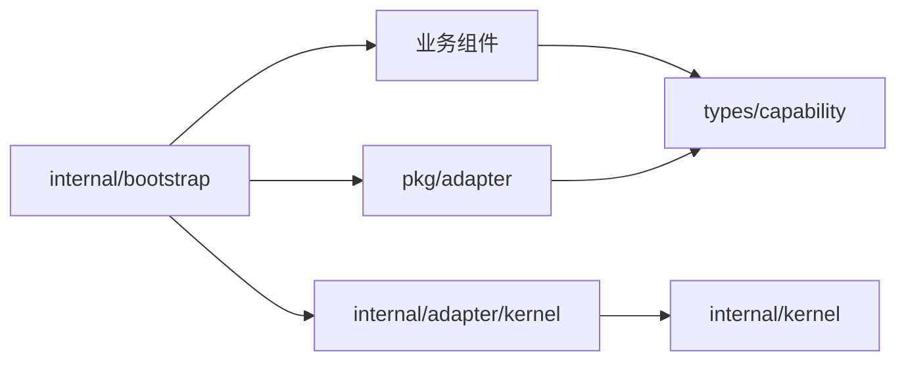
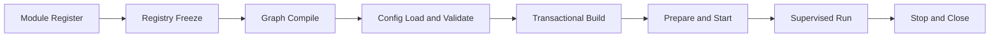

# 架构与运行链

`micro-go` 是同一 Go Module 内开发的单进程应用脚手架。它使用启动期静态图和唯一组合根
约束依赖与资源所有权，不提供运行期 Resolve、自动扫描、动态插件或跨 Module 框架 SDK。

## 依赖方向

`types/capability` 是业务依赖的稳定终点，`pkg/adapter` 实现这些能力；`internal/kernel` 拥有
运行协议，`internal/adapter/kernel` 提供默认执行实现。Bootstrap 是唯一允许同时选择两类
Adapter 的组合根。实现指向契约，契约不反向知道实现。

## 启动期静态图

Module 通过 Registry 声明配置、Provider、Binding 和 Export。Register 完成后 Registry 冻结，
Compiler 校验唯一性、可见性、缺失依赖、Provider 环和模块环，并生成稳定拓扑计划。Dig 只
执行已经验证的计划；Application 进入 Running 后不保留可供业务查询的容器。

依赖图的边从依赖指向消费者，因此构造、Prepare 和 Start 都是依赖优先；Stop 与 Close 反向
执行，消费者先退出。模块之间只能经已绑定且导出的接口协作，具体类型和配置保持模块私有。

## 配置与运行链

Koanf 每次从空树构建候选 Snapshot，不拥有当前配置；fsnotify 只报告“可能变化”，不调用业务
组件。Runtime 统一协调构造、生命周期、Runner、Observer、Reload 和关闭。所有超时都是
Context 协作式预算，错误和清理失败通过标准错误链完整返回。

具体执行步骤见[Runtime 执行链](../maintenance/kernel-runtime.md)，已确认边界见
[架构决策](../decisions/README.md)。
