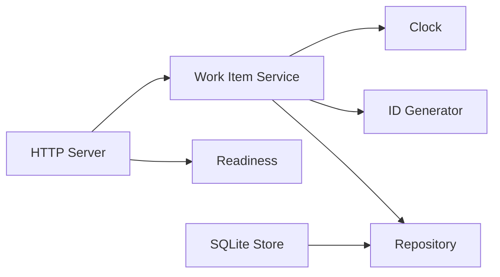

# 后端纵切片验收系统

本页定义用于证明脚手架能够承载真实后端工作流的 Work Item 验收系统。它不是 `micro-go`
默认业务产品，也不是要求所有项目采用的通用 CRUD 层；实现位于 `internal/acceptance/workitems`，
只由进程级验收测试装配。

## 验收用例

开发者需要能够创建一个工作项、按 ID 查询，并把 Open 工作项完成。数据必须在应用关闭并
重新启动后仍然存在，完成操作必须在数据库事务内保持一致。

HTTP 契约：

| 请求 | 成功 | 主要失败 |
| --- | --- | --- |
| `POST /v1/work-items` | `201`与完整 Work Item | 非法 JSON/标题为 `400` |
| `GET /v1/work-items/{id}` | `200` | 不存在为 `404` |
| `POST /v1/work-items/{id}/complete` | `200`，重复完成幂等 | 不存在为 `404` |
| `GET /livez` | 进程 Handler 可运行时 `200` | 无 |
| `GET /readyz` | SQLite 可查询时 `200` | 依赖失败为 `503` |
| `GET /status` | 返回 HTTP 启动与依赖就绪投影 | 无 |

Work Item 具有由 `idgen.Generator`生成的 ID、非空且最长 200 字符的标题、Open/Completed 状态、
创建时间和可选完成时间。HTTP 只接受已知 JSON 字段并限制请求体大小，内部错误只记录诊断，
不会作为响应正文泄漏。

## 组件与所有权

- Service 定义并依赖 Repository 契约，不导入 SQLite。
- SQLite Store 在 Prepare 打开连接并事务性执行迁移，在 Close 释放连接。
- HTTP Server 在 Prepare 建立 Listener，在 Runner 中 Serve，在 Stop 中 Shutdown。
- Bootstrap 验收测试是唯一组合位置，复用当前 Logger、Clock 和 ID Module。

## SQLite Adapter 选型边界

验收实现固定 `modernc.org/sqlite v1.55.0`：其 Module 声明 Go 1.25，提供 `database/sql`驱动，
不要求 CGO，便于同一协议测试在 Windows 与 Linux 执行；随包 LICENSE 是允许源码与二进制
再分发的 BSD 风格许可。选择只影响 `internal/acceptance/adapter/sqliteworkitems`，业务契约和
HTTP 不导入驱动类型。

该选择不表示生产项目必须采用 SQLite。真实项目仍需按容量、并发写入、备份恢复、许可证、
安全记录、维护活跃度和运行环境重新评估数据库；替换时实现现有 Repository/Readiness，并在
Bootstrap 选择新 Adapter，不修改 Work Item Service。

## 配置与 Reload

`workitems.http`声明监听地址、读写/空闲超时和请求体上限；`workitems.database.path`声明 SQLite
文件。监听地址、数据库路径和超时都不原地变化，配置变化时由没有实现 Reloader 的组件请求
`RestartRequired`。测试使用临时数据库和环回随机端口，不硬编码机器路径或端口。

## 非目标

- 不提供认证、租户、列表分页、删除、全文检索或分布式一致性。
- 不把 SQLite 确立为所有业务项目的默认数据库。
- 不新增第二个生产命令或绕过 `cmd/app` 的产品入口。
- 不据此宣称 PostgreSQL、MySQL、Redis 或消息协议已经验证。

## 完成证据

带 `integration`标签的测试覆盖启动、readiness、创建、查询、幂等完成、关闭、重新构建
Application 后的持久化查询、非法请求、未知字段和无 goroutine 泄漏；配置拒绝由 Bootstrap
配置监听测试覆盖。Unix 集成测试还会启动真实测试子进程、完成一次 HTTP 写入、发送 SIGTERM
并要求退出码为 0。外部协议验证与 Kernel 单元门禁必须分别报告。
