# Capability 封装与注入

本页是当前仓库新增业务 Capability 的唯一端到端教程。它先按真实代码解释 Clock、ID Generator
和 Logging 怎样进入默认 `process`，再给出不对应任何现有包的通用 `Options` 接入模板。

## 先看最终答案

能力不会因为代码放进 `pkg/adapter` 就自动进入应用。完整链路是：

```mermaid
flowchart LR
    C["types/capability：消费者契约"] --> A["pkg/adapter：具体实现"]
    A --> M["Bootstrap Module：Provide"]
    M --> B["Bind：具体类型到接口的同实例别名"]
    B --> E["Export：允许其他 Module 使用接口"]
    E --> W["WithModules：选择 Module"]
    W --> P["Compiler：解析并冻结依赖图"]
    P --> D["Dig Constructor：Build 阶段构造"]
    D --> N["消费者构造函数参数"]
    N --> F["消费者字段"]
```



当前最终注入点是 [`newProcess`](../../internal/bootstrap/module_application.go)。它只声明项目
Capability，不接收 Adapter、配置、Registry 或 Dig：

```go
func newProcess(
    cfg applicationConfig,
    logger logging.Logger,
    appClock clock.Clock,
    ids idgen.Generator,
) *process {
    return &process{
        name:   cfg.Name,
        logger: logger.Named("app"),
        clock:  appClock,
        ids:    ids,
    }
}
```

所以“注入到哪里”有两个准确答案：依赖先作为 `newProcess` 的普通 Go 参数传入，随后分别保存到
`process.logger`、`process.clock` 和 `process.ids`。没有运行期 `Resolve`、字段扫描或全局容器。

## 当前三项能力的注入路径

默认组合根 [`bootstrap.run`](../../internal/bootstrap/bootstrap.go)明确选择四个 Module：

```go
runtimeadapter.WithModules(
    newLoggingModule(kernelLogger),
    clockModule{},
    idModule{},
    applicationModule{},
)
```

Module 不在这个列表中，其声明就不会被收集。列表顺序用于产生稳定结果，真正的构造先后由
Provider 参数形成的依赖关系决定。

| 能力 | Provider 结果 | Binding / Export | 最终消费者 |
| --- | --- | --- | --- |
| Clock | `clocksystem.New → *clocksystem.Clock` | `clock.Clock` | `newProcess → process.clock` |
| ID Generator | `uuidadapter.New → *uuidadapter.Generator` | `idgen.Generator` | `newProcess → process.ids` |
| Logging | `loggingConfig → loggingModule.provide → *managedLogger` | `logging.Logger` | `newProcess → process.logger` |

### Clock：无配置的直接接入

业务看到的契约位于 [`types/capability/clock`](../../types/capability/clock/clock.go)：

```go
type Clock interface {
    Now() time.Time
}
```

具体实现位于 [`pkg/adapter/clock/system`](../../pkg/adapter/clock/system/system.go)，构造函数返回
具体指针。Bootstrap 的 [`clockModule`](../../internal/bootstrap/module_clock.go)登记三项事实：

```go
func (clockModule) Register(registry module.Registry) error {
    if err := module.Provide(registry, clocksystem.New); err != nil {
        return err
    }
    if err := module.Bind[clock.Clock, *clocksystem.Clock](registry); err != nil {
        return err
    }
    return module.Export[clock.Clock](registry)
}
```

- `Provide` 告诉依赖图怎样创建 `*clocksystem.Clock`。
- `Bind` 把同一个具体实例作为 `clock.Clock` 使用，不会再创建一只 Clock。
- `Export` 允许另一个 Module 的 Provider 请求 `clock.Clock`；具体类型仍是模块私有细节。

`applicationModule` 注册的 `newProcess` 请求 `clock.Clock`，Compiler 将该接口解析到上述具体
Provider，Constructor 构造后把接口参数传给 `newProcess`，最终保存为 `process.clock`。

### ID Generator：与 Clock 相同的直接接入

[`idModule`](../../internal/bootstrap/module_idgen.go)采用相同形状：

```go
func (idModule) Register(registry module.Registry) error {
    if err := module.Provide(registry, uuidadapter.New); err != nil {
        return err
    }
    if err := module.Bind[idgen.Generator, *uuidadapter.Generator](registry); err != nil {
        return err
    }
    return module.Export[idgen.Generator](registry)
}
```

第三方 `google/uuid` 只存在于 [`pkg/adapter/idgen/uuid`](../../pkg/adapter/idgen/uuid/uuid.go)内部。
消费者只知道 `idgen.Generator`，最终取得的仍是 `uuidadapter.New` 创建的同一个 Generator。

### Logging：配置和生命周期桥接

Logging 不是第二个“直接 New”示例。Kernel 在配置加载和业务图构造之前就必须能记录诊断，
因此 Bootstrap 先创建唯一的 Kernel Slog：

```go
kernelLogger := kernelslog.New(diagnosticWriter)
```

随后 `newLoggingModule(kernelLogger)`把这个指针交给
[`loggingModule`](../../internal/bootstrap/module_logging.go)。该 Module：

1. 用 `module.Config[loggingConfig](registry, "logging")`声明强类型配置所有权；
2. 用 `loggingModule.provide`把 `loggingConfig`翻译成 `kernelslog.Config`并配置原指针；
3. 返回嵌入同一 Logger 的 `*managedLogger`，桥接 Reload 语义；
4. 将 `*managedLogger`绑定并导出为 `logging.Logger`。

```go
func (m loggingModule) Register(registry module.Registry) error {
    if err := module.Config[loggingConfig](registry, "logging"); err != nil {
        return err
    }
    if err := module.Provide(registry, m.provide); err != nil {
        return err
    }
    if err := module.Bind[logging.Logger, *managedLogger](registry); err != nil {
        return err
    }
    return module.Export[logging.Logger](registry)
}
```

`newProcess`收到 `logging.Logger`后调用 `Named("app")`派生日志命名空间，并保存到
`process.logger`。底层输出资源仍由 Bootstrap 和 Runtime 管理，业务消费者不得关闭它。

[`pkg/adapter/logging`](../../pkg/adapter/logging/README.md)中的 Zap 和 Noop 是可选公共实现，当前
默认 `WithModules`并未选择它们。默认业务 Logger 是 Bootstrap 桥接的 Kernel Slog，而不是
目录中任意一个实现被 Runtime 自动扫描出来。增强日志实现替换 Kernel Logger 的额外约束见
[ADR-0004](../decisions/adr-0004-kernel-logging.md)。

## Kernel 怎样完成构造注入

Module 的 `Register`只写入声明，不会执行构造函数。Build 期间依次发生：

1. Collector 按 `WithModules`收集 `Config`、`Provider`、`Binding`和 `Export`，然后冻结 Registry。
2. Compiler 校验 Provider 签名、配置所有权、接口实现、跨模块可见性、缺失依赖和循环，并生成
   依赖在前、消费者在后的稳定 Plan。
3. Loader 合并默认值、文件和环境变量，把配置路径解码成各 Module 拥有的强类型值。
4. Dig Constructor 只在 Build 阶段登记配置和 Provider；每个 Binding 通过一个类型转换函数
   返回原实现实例的接口视图。
5. Constructor 按 Plan 请求每个 Provider。构造 `process`时，Dig 调用 `newProcess`并把三个
   Capability 作为普通参数传入。
6. 构造完成后 Application 只保存实例集合并驱动生命周期；业务运行期没有容器可供查询。

声明的精确语义如下：

| 声明 | 回答的问题 | 不会做什么 |
| --- | --- | --- |
| `Config[T](path)` | 哪个 Module 拥有哪段强类型配置 | 不读取环境变量，不创建 Adapter |
| `Provide(constructor)` | 具体类型怎样构造 | 不立即调用构造函数 |
| `Bind[Contract, Implementation]` | 哪个具体类型实现接口 | 不创建第二个实例 |
| `Export[Contract]` | 哪个接口允许跨 Module 使用 | 不公开具体实现 |
| `WithModules(...)` | 本次应用选择哪些 Module | 不自动扫描目录 |
| Provider 参数 | 当前组件依赖哪些配置或组件 | 不执行运行期 Resolve |

Compiler 和 Constructor 的详细内部约束分别见
[`compiler`](../../internal/adapter/kernel/di/compiler/README.md)和
[`dig`](../../internal/adapter/kernel/di/dig/README.md)。

## 新能力的接入顺序

新增能力时按下面顺序工作，不要从“先写一个 Adapter”开始：

1. 找到真实消费者，用普通构造函数参数表达它需要的最小行为。
2. 只有这个行为需要跨业务包稳定协作时，才在 `types/capability/<name>`定义项目契约。
3. 评估标准库、仓库现有实现和成熟第三方库，在 `pkg/adapter/<name>/<implementation>`实现
   契约；导出签名不暴露第三方类型。
4. 在 `internal/bootstrap/module_<name>.go`选择具体实现。无配置实现直接注册构造函数；有配置
   实现由固定签名 Provider 把部署配置翻译为 Adapter 构造参数或 `Options`。
5. 在同一 Module 内依次声明 `Config`（如需）、`Provide`、`Bind`和 `Export`。
6. 把 Module 加入 Bootstrap 的 `WithModules`。
7. 让真实消费者 Provider 接收 Capability，并在构造结果中保存它；这里就是最终注入点。
8. 验证契约、Adapter、Module 编译失败以及消费者行为，不创建只为展示依赖图的假业务组件。

契约由消费者需求驱动，Adapter 依赖并实现契约；消费者和契约都不得反向导入具体 Adapter。

## 有 Options 时怎样接入

当前 Clock 和 UUID 没有配置；默认 Logging 使用 `loggingConfig → kernelslog.Config`，没有公共
Functional Options。下面只演示将来某个 Adapter 已经使用 `New(options ...Option)`时的接入
形状，代码中的 `technologyadapter`、`projectcapability`和类型名都不是当前仓库 API。

Adapter 可以保留适合直接使用和测试的 Functional Options：

```go
// 示意代码：位于某个具体 Adapter 包，不是当前仓库已存在的 API。
type Option func(*settings) error

func WithTimeout(timeout time.Duration) Option {
    return func(value *settings) error {
        if timeout <= 0 {
            return errors.New("timeout must be positive")
        }
        value.timeout = timeout
        return nil
    }
}

func New(options ...Option) (*Adapter, error) {
    value := settings{timeout: defaultTimeout}
    for _, option := range options {
        if option == nil {
            return nil, errors.New("adapter option is nil")
        }
        if err := option(&value); err != nil {
            return nil, fmt.Errorf("apply adapter option: %w", err)
        }
    }
    return &Adapter{timeout: value.timeout}, nil
}
```

但当前 Compiler 明确拒绝变参 Provider，所以不能写
`module.Provide(registry, technologyadapter.New)`。Bootstrap 应提供固定签名函数，并在唯一技术
选择边界把部署配置翻译成 Options：

```go
// 示意代码：名字只表达 Module 接入形状，不能作为现有包路径复制。
type capabilityConfig struct {
    Timeout time.Duration `yaml:"timeout" json:"timeout" validate:"gt=0"`
}

func provideCapability(cfg capabilityConfig) (*technologyadapter.Adapter, error) {
    return technologyadapter.New(
        technologyadapter.WithTimeout(cfg.Timeout),
    )
}

func (capabilityModule) Register(registry module.Registry) error {
    if err := module.Config[capabilityConfig](registry, "capability"); err != nil {
        return err
    }
    if err := module.Provide(registry, provideCapability); err != nil {
        return err
    }
    if err := module.Bind[projectcapability.Contract, *technologyadapter.Adapter](registry); err != nil {
        return err
    }
    return module.Export[projectcapability.Contract](registry)
}
```

三类值不要混淆：

| 值 | 所属边界 | 会注入消费者吗 |
| --- | --- | --- |
| Adapter `Option` | Adapter 构造 API | 否 |
| Module 私有强类型配置 | Bootstrap 的技术选择与部署边界 | 否 |
| 项目 Capability | 消费者稳定依赖 | 是 |
| Runtime `Option` | `runtime.Build`的模块、Source 和超时选择 | 否 |

Adapter Options 不是“可选契约配置”。契约只描述消费者需要的行为；算法、超时、连接参数、
重试和输出位置等技术配置留在 Adapter 与 Bootstrap。Options 校验或构造失败必须向上返回并
使 Build 失败，不能静默回退默认实现或创建第二套实例。

## 常见接入失败

| 现象 | 原因 |
| --- | --- |
| Module 文件存在但能力未生效 | 没有把 Module 加入 `WithModules` |
| 跨 Module 请求接口时报不可见 | 提供方没有 `Export`，或消费者请求了具体类型 |
| Binding 编译失败 | 实现没有对应具体 Provider、未实现接口或不属于当前 Module |
| Provider 被拒绝 | 构造函数是变参、返回接口、返回多个非 error 值或签名不是普通函数 |
| 构造时缺少依赖 | 没有 Provider、接口没有 Binding，或所需配置没有声明 |
| Options 出现在业务代码 | 配置翻译越过 Bootstrap 边界，消费者开始依赖具体技术 |
| 运行期查询容器 | 把显式构造注入退化成 Service Locator；当前设计不支持这种做法 |

## 验证

纯文档修改至少执行：

```powershell
go test ./internal/architecture -run '^TestDocumentation' -count=1
git diff --check
```

真实新增 Capability 还应覆盖契约测试、Adapter 错误与资源语义、Module 注册和消费者行为，并
执行完整门禁：

```powershell
./scripts/verify.ps1
```

具体 Adapter 的配置、资源所有权和可编译 Example 从
[`pkg/adapter` 使用中心](../../pkg/adapter/README.md)进入；配置来源与 Reload 继续分别以
[配置开发](configuration.md)和[生命周期与 Reload](lifecycle-and-reload.md)为权威说明。
