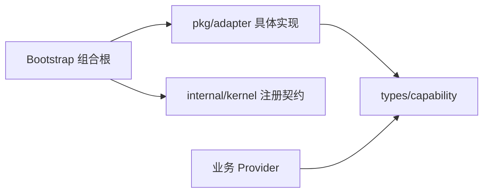

# Adapter 组合根接入

本页说明当前仓库如何把 `pkg/adapter` 接入静态依赖图。新增 Adapter 的设计流程仍以
[Capability 与 Adapter](../../docs/development/capability-adapters.md)为准。

## 依赖方向



业务 Provider 和 Adapter 都依赖 Capability；Bootstrap 选择具体实现并声明静态图。Adapter
不得导入 Kernel，业务 Provider 也不得接收 Adapter 或第三方具体类型。

## 无状态 Adapter

System Clock 和 UUID Generator 没有配置与关闭资源。Bootstrap 直接注册构造函数，再把具体
类型绑定和导出为 Capability：

```go
if err := module.Provide(registry, system.New); err != nil {
    return err
}
if err := module.Bind[clock.Clock, *system.Clock](registry); err != nil {
    return err
}
return module.Export[clock.Clock](registry)
```

当前完整装配见 [`clockModule`](../../internal/bootstrap/bootstrap.go)和
[`idModule`](../../internal/bootstrap/bootstrap.go)。消费者只声明 `clock.Clock` 或
`idgen.Generator` 构造参数。

## 配置和资源型 Adapter

Slog 需要配置、Reload 和 Close，但这些 Kernel 协议不会进入 Adapter 包。Bootstrap 使用私有
`managedLogger` 完成四项工作：

1. 声明并接收强类型 `logging` 配置。
2. 把应用配置转换为 `slog.Config` 后调用 `slog.New`。
3. 把 `Logger.Apply` 的结果转换为 Kernel Reload 结果。
4. 通过嵌入保留 `Logger.Close`，由 Runtime 生命周期统一释放资源。

该桥接只存在于 [`internal/bootstrap/bootstrap.go`](../../internal/bootstrap/bootstrap.go)。业务代码
不能直接 Reload 或 Close 共享 Logger，也不能自行创建第二个输出资源。

## 替换实现

替换 Slog 为 Zap 时，应在同一个组合根中单轨修改构造、配置类型和 Reload 结果翻译，并复用
`logging.Logger` Binding。不要同时导出两个未限定的 Logger，也不要在构造失败时回退 Noop。

替换前先阅读 [Logging 选择矩阵](logging/usage.md)，并确认目标实现的 Context、编码器、文件
资源和 Reload 语义满足应用需要。

## 验证入口

- `go test ./pkg/adapter/...`：运行契约测试和全部可编译 Example。
- `go test ./internal/bootstrap`：验证当前 Slog 配置和 Reload 桥接。
- `go test ./internal/architecture`：验证 Adapter、Capability 与 Bootstrap 的依赖边界。
- `go test ./internal/architecture -run '^TestDocumentation'`：验证使用文档索引和链接。
