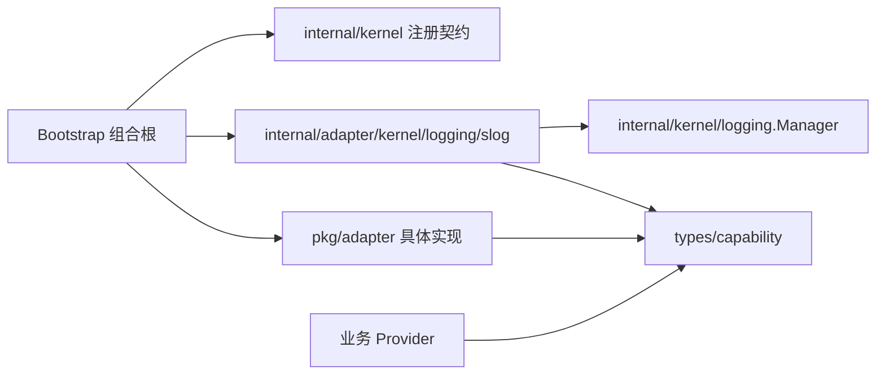

# Adapter 组合根接入

本页说明当前仓库如何把 `pkg/adapter` 接入静态依赖图。新增 Adapter 的设计流程仍以
[Capability 与 Adapter](../../docs/development/capability-adapters.md)为准。

## 依赖方向



业务 Provider 和 Adapter 都依赖 Capability；Bootstrap 选择具体实现并声明静态图。Adapter
不得导入 Kernel，业务 Provider 也不得接收 Adapter 或第三方具体类型。

## 统一注入流程

每个 Capability 在 `internal/bootstrap/module_<capability>.go` 中拥有独立 Module，并按相同顺序
完成装配：可选地声明 `Config`，`Provide` 具体实现，`Bind` 到 Capability，最后 `Export` 接口。
`bootstrap.go` 只通过 `WithModules` 选择这些 Module，不展开单项能力的构造与桥接细节。

| Capability | 独立装配文件 | 差异 |
| --- | --- | --- |
| Logging | [`module_logging.go`](../../internal/bootstrap/module_logging.go) | Kernel 必有 Slog 的配置、Reload 与业务导出 |
| Clock | [`module_clock.go`](../../internal/bootstrap/module_clock.go) | 无状态构造 |
| ID Generator | [`module_idgen.go`](../../internal/bootstrap/module_idgen.go) | 无状态构造 |

统一的是显式声明流程和文件职责，不使用通用 Helper 隐藏 `Provide`、`Bind` 或 `Export`。

## 无状态 Adapter

System Clock 和 UUID Generator 没有配置与关闭资源。Bootstrap 直接注册构造函数，再把具体
类型绑定和导出为 Capability：

```go
if err := module.Provide(registry, system.New); err != nil {
    return err
}
if err := module.Bind[clock.Clock, *system.Clock](registry); err != nil {
    return err
}
return module.Export[clock.Clock](registry)
```

当前完整装配见 [`clockModule`](../../internal/bootstrap/module_clock.go)和
[`idModule`](../../internal/bootstrap/module_idgen.go)。消费者只声明 `clock.Clock` 或
`idgen.Generator` 构造参数。

## Kernel 必有日志

日志是唯一双阶段能力。Bootstrap 在配置加载前创建
[`internal/adapter/kernel/logging/slog`](../../internal/adapter/kernel/logging/slog/README.md)，
将其作为 `runtime.Dependencies.Logger` 注入 Kernel；因此注册、配置和构造失败不依赖任何业务
Adapter。默认日志 Module 使用同一个实例完成四项工作：

1. 声明并接收强类型 `logging` 配置。
2. 调用 `Configure`，把早期基线切换为配置指定的 Text/JSON 和标准流/文件输出。
3. 把 `Apply` 的结果转换为 Kernel Reload 结果。
4. 将同一 Logger `Bind`、`Export` 为业务 `logging.Logger`。

Kernel Logger 的关闭所有权始终属于 Bootstrap；`run` 返回时用 `errors.Join` 保留运行错误与
日志关闭错误。业务代码不能直接 Reload、Close 或创建第二个默认输出资源。

## 显式增强替换

选择 Zap 时，需要用独立 Zap Module 替换默认业务日志 Module，并同时显式声明：

```go
runtime.Build(ctx,
    runtime.WithModules(zapLoggingModule{}, clockModule{}, idModule{}, applicationModule{}),
    runtime.WithKernelLoggerReplacement[*zap.Logger](),
)
```

该具体类型必须既有 Provider，又正是 `logging.Logger` 的 Binding。Runtime 只在全部实例构造成功
后调用 `Replace`；`Built` 和运行期事件进入 Zap。Shutdown 一开始先 `Restore`，所以 Stop、Close
和最终状态回到 Kernel 基线，而业务组件在自身 Close 前仍可使用注入的 Zap。Manager 不关闭
Zap，资源仍由提供它的 Module 和 Runtime 生命周期释放。

只选择 Noop 而不设置替换 Option 时，业务日志静默，但 Kernel 基线不静默。不要同时导出两个
未限定 Logger，也不要在构造失败时回退 Noop。

替换前先阅读 [Logging 选择矩阵](logging/usage.md)，并确认目标实现的 Context、编码器、文件
资源和 Reload 语义满足应用需要。

## 验证入口

- `go test ./pkg/adapter/...`：运行契约测试和全部可编译 Example。
- `go test ./internal/bootstrap`：验证默认 Kernel Slog 配置、Reload、文件输出和关闭。
- `go test ./internal/adapter/kernel/runtime`：验证显式替换、恢复与失败诊断。
- `go test ./internal/architecture`：验证 Adapter、Capability 与 Bootstrap 的依赖边界。
- `go test ./internal/architecture -run '^TestDocumentation'`：验证使用文档索引和链接。
